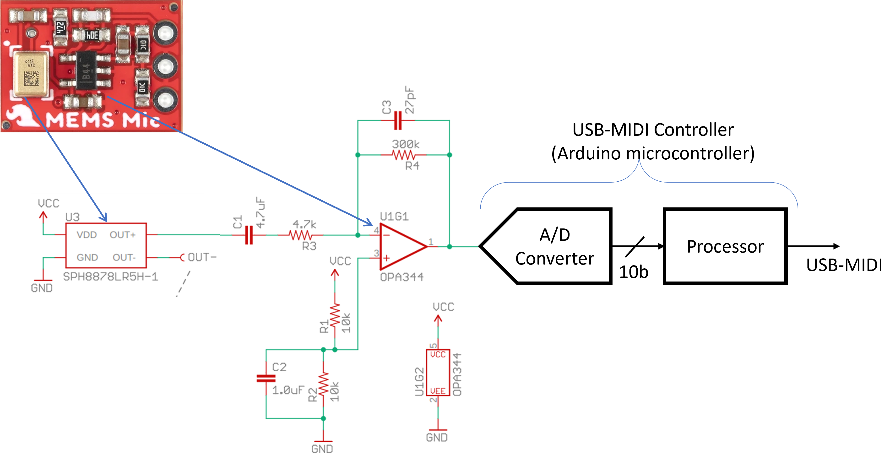
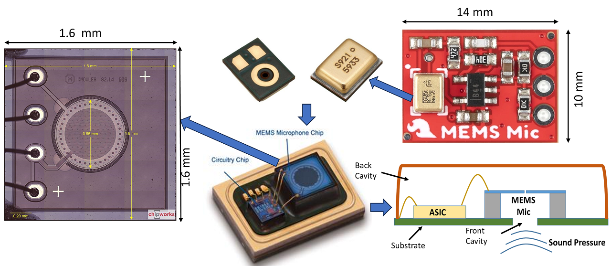

# SI-2025 Analog IC Daily Activity

## Day-1

Date: 02 June 2025 (Mon)

- [Introduction video](https://youtu.be/baAFZwcFY-M)

**USB Microphone System**

- [Knowles MEMS capacitive microphone datasheet](https://cdn.sparkfun.com/assets/0/5/8/b/1/SPH8878LR5H-1_Lovato_DS.pdf)
- [OPA344 TI OpAmp datasheet](https://www.ti.com/lit/ds/symlink/opa345.pdf)
- [SparkFun Analog MEMS Microphone Breakout - SPH8878LR5H-1](https://www.sparkfun.com/sparkfun-analog-mems-microphone-breakout-sph8878lr5h-1.html)

**USB Microphone Teardown**

**ASSIGNMENT**

- Find the _Thevenin equivalent_ circuit for the microphone for normal voice operation. 
  - A quick review of the topic can be found [here](https://mixignal-press.github.io/ebook-ice1/circuits.html#thevenin-and-norton-equivalent-circuits)
- Substitute the microphone's Thevenin's equivalent and find the _frequency response_ of the analog front-end (AFE).

